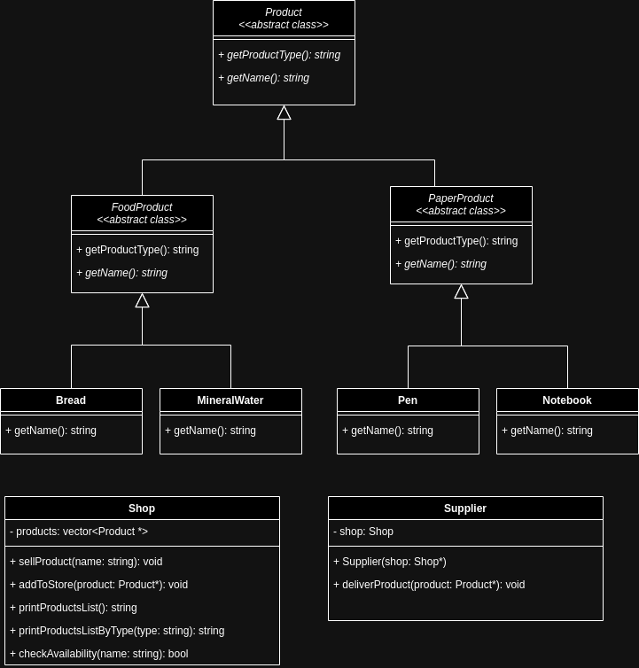

## Zadanie: Implementacja figur

## Cel zadania

Zaimplementuj klasy zgodzie z diagramem klas



i testami jednostkowymi umieszczonymi w:.

- `test_shop.cpp`

Dla przypomineia:
  -   nazwy plików składające się z więcej niż jednego członu zapisujemy rozdzielnie z twardą spacją `example_name.cpp`
  -   każda z klas powinna znajdować się w osobnym pliku wraz z dedykowanym plikiem nagłówkowym
## Test

Aby uruchomić testy jednostkowe, wykonaj komendę w termnalu:

```bash
make test_products
make test_shop
```
